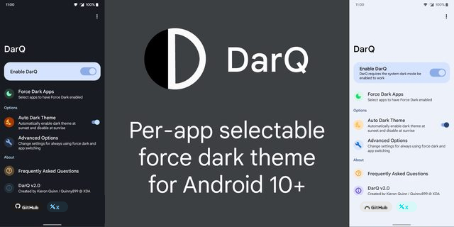

# DarQ Reborn <a href="https://github.com/Arora-Sir/DarQ-Reborn/releases"></a> <a href="https://github.com/Arora-Sir/DarQ-Reborn/releases/latest"></a>




DarQ provides a per-app selectable force dark option for Android 10 and above.

> [!NOTE]
> This is a modded fork maintained by [Mohit Arora](https://github.com/Arora-Sir). The original repository by [KieronQuinn](https://github.com/KieronQuinn/DarQ) is archived.

> [!IMPORTANT]
> **Migrating from DarQ (original) or older DarQ Reborn (pre-v3.0):**
> The package name has changed from `com.kieronquinn.app.darq` to `com.mohitarora.darqreborn`. Android treats these as two separate apps, so a one-time manual switch is required:
>
> 1. Export your settings using **Backup & Restore** inside the old app.
> 2. Uninstall the old version.
> 3. Install this version.
> 4. Import your backup from Step 1.
>
> All future DarQ Reborn updates (from this version onwards) will install as normal upgrades — no reinstall needed.

It uses a root or [Shizuku](https://shizuku.rikka.app/) (ADB) service to apply the theme seamlessly and quickly, without needing an accessibility service.

## Requirements & Setup

DarQ requires either **Root Access** or the **Shizuku** service to be running on your device to modify system theme properties.

### Shizuku Setup (For Non-Rooted Devices)
If your device is not rooted, you must set up **Shizuku** before running DarQ:
1. **Download Shizuku:**
   * **Recommended (Modded Fork):** Download and install the [thedjchi Shizuku Fork](https://github.com/thedjchi/Shizuku/releases). This version is actively maintained and highly recommended for custom, aggressive OEM skins (such as Xiaomi/HyperOS, OPPO/ColorOS, etc.) because it includes:
     * A **Watchdog service** that automatically restarts Shizuku's background process if it gets killed by the system.
     * Robust boot startup logic (e.g., waiting for Wi-Fi connection).
     * Quality-of-life patches like ADB-over-TCP settings and intent controls.
   * **Original Version:** Alternatively, you can install the original version from the [Google Play Store](https://play.google.com/store/apps/details?id=moe.shizuku.privileged.api) or the [RikkaApps Shizuku GitHub Repository](https://github.com/RikkaApps/Shizuku).
2. Open Shizuku and follow the in-app guide to start the service (using Wireless Debugging on Android 11+ or ADB command line on a computer).
3. Once the Shizuku service is running, open DarQ and grant it Shizuku access when prompted.
> [!IMPORTANT]
> **Device-Specific & Background Requirements:**
> * **Xiaomi / Redmi / POCO:** You must enable **"USB Debugging (Security settings)"** in Developer Options, and set Shizuku's Battery Saver to **"No restrictions"** in system App Info.
> * **OPPO / OnePlus / Realme:** You must enable the **"Disable permission monitoring"** (or **"Disable system optimization"** in newer builds) setting in Developer Options to prevent the OS from blocking the connection.
> * **Background Service Termination (OnePlus / Oppo / Xiaomi):** If you find that you have to manually open DarQ to make apps dark again after a while, the system has killed the background DarQ process. Go to **Advanced Options** in the app, enable **"Keep service running in background"**, and click **"Manage Notification"** to hide or minimize the status bar icon if desired.

### Xposed / LSPosed Mode Setup

If you are using the **Xposed / LSPosed** mode (to override apps that block Force Dark in code), the setup requires two steps:

1. **LSPosed Manager -> DarQ module scope**: Add the apps you want Force Dark to work on. This gives DarQ permission to inject into those app processes.
2. **DarQ app -> App picker**: Select the same apps to enable Force Dark on them, **or** enable **"Always use Force Dark"** in **Advanced Options** to skip this step and automatically apply Force Dark to everything in the LSPosed scope.

> [!IMPORTANT]
> **Do not add System Framework or System UI** to the LSPosed scope. DarQ works inside each individual app process and does not need system-level access. Adding System Framework is unnecessary and may cause system UI glitches or instability.

See the [FAQ](https://github.com/Arora-Sir/DarQ-Reborn/blob/master/app/src/main/assets/faq.md#how-should-i-configure-the-lsposed--xposed-scope-for-darq) for more detail on the LSPosed scope configuration.

### Automation & ADB Triggering (MacroDroid/Tasker/Termux)
If you use automation apps (such as MacroDroid, Tasker, or Automate) and want to start DarQ's background service externally, send a broadcast with the following details:

* **Target**: `Broadcast` / `BroadcastReceiver`
* **Action**: `com.mohitarora.darqreborn.ACTION_START_SERVICE`
* **Package**: `com.mohitarora.darqreborn`
* **Class**: `com.kieronquinn.app.darq.receivers.TriggerReceiver`
* **Flags**: `32` (`FLAG_INCLUDE_STOPPED_PACKAGES`)

> [!TIP]
> Specifying the explicit **Class** and **Flags: 32** ensures the broadcast successfully wakes up and triggers DarQ across all Android versions (Android 8.0+ through 14+) on any device, under all conditions (normal operation, background, or force-stopped).

Alternatively, you can trigger it via ADB shell or Termux:

```bash
adb shell am broadcast -a com.mohitarora.darqreborn.ACTION_START_SERVICE -n com.mohitarora.darqreborn/com.kieronquinn.app.darq.receivers.TriggerReceiver -f 32
```


### Auto Dark Theme & Scheduling

DarQ provides automated dark theme scheduling to protect your eyes when needed:

* **Schedule Modes:**
  * **Sunset to Sunrise:** Automatically switches dark theme at sunset and sunrise using location calculations or optional GPS positioning.
  * **Custom Time Schedule:** Set custom start (Dark Mode ON) and end (Dark Mode OFF) times according to your routine.
* **Schedule Targets:**
  * **System & DarQ Dark Mode:** Toggles Android System Dark Mode and DarQ Per-App Force Dark simultaneously. Currently open apps switch instantly when the boundary crosses because Android OS broadcasts system-wide `uiMode` configuration changes.
  * **DarQ Force Dark Only:** Toggles per-app force dark without altering system dark mode. The updated rendering mode applies when target apps are next launched or reopened (this prevents DarQ from force-closing active apps or interrupting unsaved work in open sessions).

> [!NOTE]
> Disabling Auto Dark Schedule at any time (including during a light period) immediately restores full DarQ per-app force dark functionality. Your manual **Enable DarQ** toggle is never permanently modified by the schedule - the two states are always kept separate.

Please read the Frequently Asked Questions sections in the app or [here](https://github.com/Arora-Sir/DarQ-Reborn/blob/master/app/src/main/assets/faq.md) for more information and answers.


## Troubleshooting & Bug Reporting

If you encounter crashes or issues, sharing a logcat log is extremely helpful for diagnostics. Here is how to capture it on-device:

1. Install an open-source log viewer like [**LogFox**](https://github.com/F0x1d/LogFox).
2. Open LogFox and grant it Shizuku access.
3. Start recording logs, launch DarQ Reborn to trigger the crash, and copy the captured logs from the notification pop-up.
4. Share the copied crash log in your bug report or GitHub issue.

[Download from GitHub Releases](https://github.com/Arora-Sir/DarQ-Reborn/releases)
